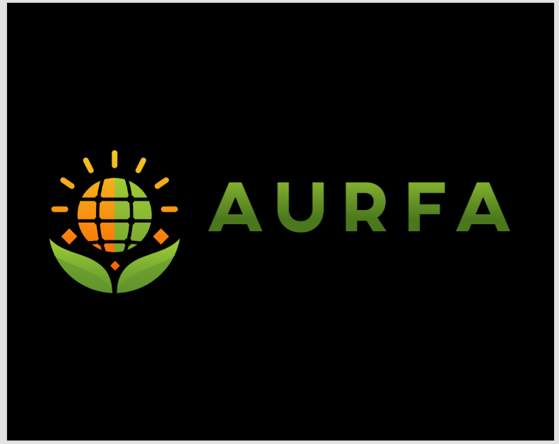

# 🌱 AURFA - AI Urban Rooftop Farming Advisor

AURFA (AI Urban Rooftop Farming Advisor) is a web-based application that helps users transform their unused rooftops into productive green spaces. The platform leverages AI and APIs to analyze rooftop space, sunlight, weather, and other conditions to recommend the most suitable crops for urban farming.

[]

<p align="center">
  
</p>

## 🌟 Overview

AURFA is designed to revolutionize urban farming by making it accessible to everyone. Whether you're a beginner or an experienced gardener, our AI-powered platform provides personalized recommendations and insights to help you create a successful rooftop garden.

## 🚀 Features

- 🗺️ **Rooftop Analyzer**: Analyze rooftop area using satellite map view.
- 🌞 **Sunlight Estimator**: Estimate sunlight based on geo-coordinates and exposure.
- 🌦️ **Weather & Seasonal Data Integration**: Get real-time weather insights for crop selection.
- 🌱 **Smart Crop Recommendations**: Suggests the best crops (vegetables, herbs, fruits) based on environment.
- 📈 **Yield Prediction**: Forecast expected production and productivity.
### �️ Rooftop Analyzer
- Interactive map interface with Leaflet.js
- Precise area calculation tools
- Sunlight exposure analysis
- Location-based recommendations

### 🌞 Smart Environment Analysis
- Real-time sunlight estimation
- Local weather integration
- Climate zone identification
- Seasonal planning assistance

### 🌱 Crop Recommendations
- AI-powered crop selection
- Personalized growing guides
- Companion planting suggestions
- Season-appropriate choices

### 📈 Yield Prediction
- Production forecasting
- Growth timeline estimation
- Resource requirement calculation
- Harvest scheduling

### 💧 Resource Management
- Water requirement tracking
- Optimal irrigation scheduling
- Resource optimization tips
- Sustainability metrics

## 🛠️ Tech Stack

### Frontend
- HTML5
- CSS3 (with Bootstrap 5)
- JavaScript (ES6+)
- Font Awesome Icons
- Google Fonts

### APIs & Services
- 🗺️ Leaflet.js for mapping
- 🌤️ OpenWeather API for weather data
- 📍 OpenCage API for geocoding
- 🚀 Firebase for authentication
- 💾 Firestore for data storage

### Development Tools
- VS Code
- Git & GitHub
- Netlify for deployment

## 📂 Project Structure

```
aurfa/
├── assets/
│   ├── css/
│   │   ├── style.css
│   │   └── analysis.css
│   ├── js/
│   │   ├── script.js
│   │   └── config.js
│   ├── images/
│   │   ├── logo.png
│   │   └── other images...
│   └── videos/
│       └── demo videos...
├── index.html
└── README.md
```

## 🚀 Getting Started

1. **Clone the repository**
   ```bash
   git clone https://github.com/Ved2162/Aurfa.git
   cd Aurfa
   ```

2. **Configure API Keys**
   - Create a `config.js` file in the assets/js directory
   - Add your API keys:
     ```javascript
     const config = {
       weatherApiKey: 'YOUR_OPENWEATHER_API_KEY',
       geocodeApiKey: 'YOUR_OPENCAGE_API_KEY',
       // Add other API keys as needed
     };
     ```

3. **Set up Firebase**
   - Create a Firebase project
   - Enable Authentication and Firestore
   - Update Firebase configuration in your project

4. **Run Locally**
   - Use a local development server (e.g., Live Server in VS Code)
   - Open `index.html` in your browser

## 🤝 Contributing

We welcome contributions! Please follow these steps:

1. Fork the repository
2. Create a new branch: `git checkout -b feature-name`
3. Make your changes
4. Submit a pull request

## 📝 License

This project is licensed under the MIT License - see the [LICENSE](LICENSE) file for details.

## 👨‍💻 Developer

- **Ved Prajapati**
  - Portfolio: [ved2162-portfolio.netlify.app](https://ved2162-portfolio.netlify.app)
  - GitHub: [@Ved2162](https://github.com/Ved2162)
  - Email: aurfa2162@gmail.com

## � Acknowledgments

- OpenWeather API for weather data
- OpenCage API for geocoding services
- Leaflet.js for mapping functionality
- Bootstrap team for the UI framework
- Font Awesome for icons
- All our contributors and users

---

<p align="center">
  Made with 💚 by Ved Prajapati
</p>


